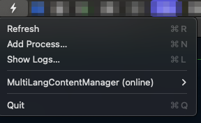
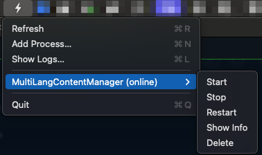

<!-- PROJECT LOGO -->
# PM2 Monitor for macOS

Lightweight macOS status-bar utility to view and control PM2-managed Node.js processes without a terminal.

<!-- Badges -->


---

## Overview
PM2 Monitor is a minimal native macOS app that places a small icon in the status bar and exposes an interactive menu that lists PM2-managed processes. From the menu you can refresh the list and perform common actions (start, stop, restart) on processes.

This repository contains a working prototype implemented in Swift (AppKit) and a small scaffold to call PM2 CLI commands. The goal is a compact native utility that complements PM2 by exposing quick controls in the macOS UI.

## Features (prototype)
- Native status-bar item implemented in Swift + AppKit
- Read processes from PM2 (`pm2 jlist`) and display name & status
- Start / Stop / Restart / Delete actions wired to PM2 CLI
- Add new process via modal window (custom command and optional name)
- Show process info (PM2 details)
- Basic notifications and debug logging to `/tmp/pm2monitor.log`

## Screenshot

### Screenshots


<div align="center">
	<table>
		<tr>
			<td align="center">
				<br/>
				<b>Main application menu</b><br/>
				Shows the dropdown menu with the list of PM2 processes and general actions.
			</td>
			<td align="center">
				<br/>
				<b>Process actions menu</b><br/>
				Shows the dropdown menu for a background process, with options for Start, Stop, Restart, Delete, and Show Info.
			</td>
			<td align="center">
				<br/>
				<b>Add process window</b><br/>
				Shows the modal window to add a new process to PM2, with fields for command and name.
			</td>
		</tr>
	</table>
</div>

---

## Quick start (developer)
Requirements:
- macOS with Xcode Command Line Tools installed
- PM2 installed and accessible (e.g. `/opt/homebrew/bin/pm2`)

Build and run locally:

```bash
mkdir -p build
swiftc App/main.swift -o build/pm2monitor -framework Cocoa
./build/pm2monitor
```

Notes:
- If the app cannot find `pm2` when launched from Finder, run it from a terminal or set the PM2 binary path in `App/main.swift`.
- The prototype writes debug logs to `/tmp/pm2monitor.log`.

---

## How to use

### Viewing and managing processes
- Click the status bar icon to open the menu.
- The list shows all PM2-managed processes with their name and status.
- For each process, you can:
	- **Start**: Start a stopped process.
	- **Stop**: Stop a running process (confirmation required).
	- **Restart**: Restart a process (confirmation required).
	- **Delete**: Remove the process from PM2 (confirmation required).
	- **Show Info**: View detailed PM2 info for the process.

### Adding a new process
1. Click "Add Process…" in the menu.
2. A modal window will appear with two fields:
	 - **Command**: Enter the full command to run (e.g. `node server.js --port 3000`). This field is required.
	 - **Name**: Optionally enter a name for the process. If left blank, PM2 will use the command as the name.
3. Click **Start** to create the process in PM2. If a process with the same name or executable already exists, you will be prompted to confirm before creating a duplicate.
4. The process will be started and appear in the list.

**Tip:** If you need to run a shell command, you can prefix with `-c` (e.g. `-c "echo hello && sleep 10"`). The app will use bash as the interpreter for such commands.

### Deleting a process
1. In the submenu for each process, select **Delete**.
2. Confirm the deletion in the dialog. The process will be removed from PM2 and disappear from the list.

### Debugging
- Debug logs are written to `/tmp/pm2monitor.log`.
- To enable debug mode, set the environment variable `PM2MONITOR_DEBUG=1` before launching, or set the UserDefault `pm2monitorDebug`.

---

## Development notes
- UI: Swift + AppKit
- PM2 integration: currently implemented by invoking the PM2 CLI; a Node.js helper script can be added for more robust integration.
- Keep PM2 invocations off the main UI thread and update UI on the main queue.

Planned improvements:
- Confirmations for destructive actions (Stop/Restart)
- Migrate notifications to UserNotifications framework
- Settings UI for PM2 path and refresh interval
- Packaging and signing for distribution

---

## Contributing
Contributions are welcome. If you'd like to help:

1. Open an issue describing the feature or bug.
2. Fork the repository and create a feature branch.
3. Make changes and open a pull request with a clear description.

Please keep changes small and focused.

---

## License
This repository is provided under the MIT License. See `LICENSE` for details.
